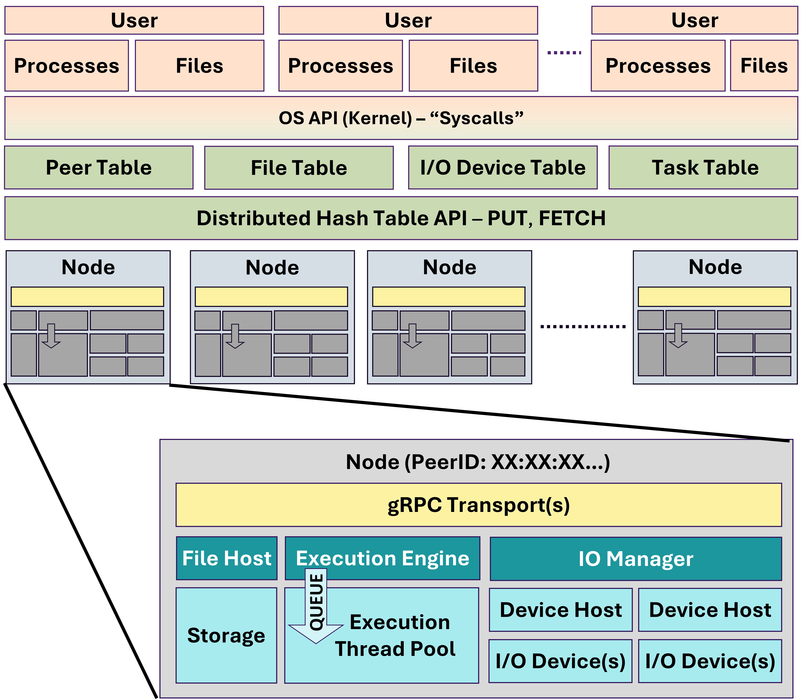
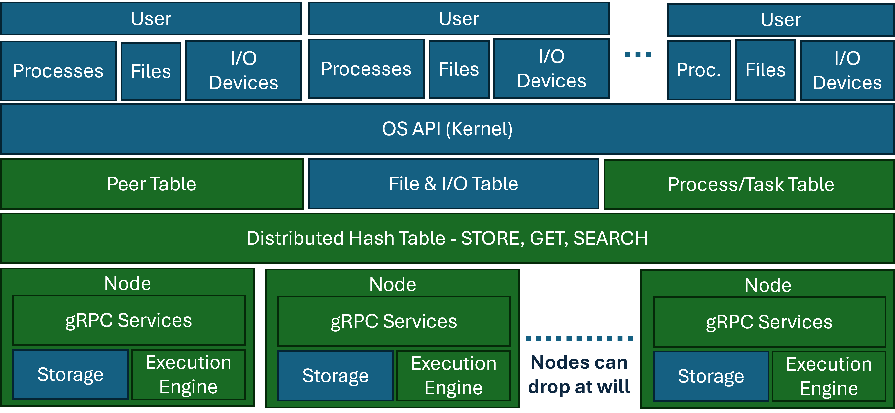

# Starfish OS

This file is just a simple overview of what the OS does and how it is all set up. See the below picture for the architecture of one node:

The lower left side is the communication system that connects out to the rest of the network.

---

The below picture is a end-user full view of the OS architecture. 

> The green on both pictures signifies what is currently built. Blue represents future work.

> The processes that each user runs are STAR processes according to programs run using the STAR_FRAMEWORK. In the long future, building a full-out compiler to translate C/C++ into task-based processes would be ideal. (Like OpenMP but task-based processes parsable by the os.)